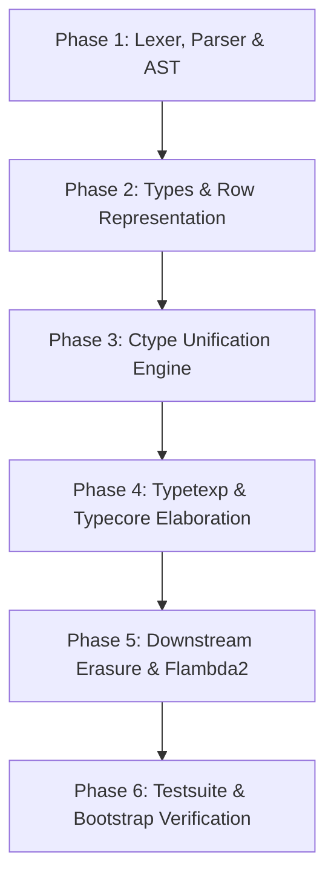

# Implementation Plan: Open-by-Default Row-Polymorphic Typed Effects for OCaml

## Executive Summary & Specification

This plan outlines the design and implementation of an open-by-default, row-polymorphic effect typing system for the OCaml compiler, conforming to the architectural specification in `ocaml_typed_effects.txt` with the following user-requested syntax enhancement:
* **Pure arrow alias:** `-[]->` is an alias for `-[ pure ]->`, denoting a closed, empty effect row `Ptyp_arrow(..., Some { erow_labels = []; erow_tail = None })`.

### Key Design Tenets
1. **Ambient Delimited Control, Not Monads:** Direct-style algebraic effects with Tier 4 multi-effect composition.
2. **Open-by-Default:** Higher-order combinators (e.g., `List.map`) infer open effect rows ($\forall \rho$). Legacy standard libraries act as transparent effect pipelines without requiring manual effect annotations.
3. **Purity as Explicit Restriction:** Purity is opt-in via `-[]->` or `-[ pure ]->` (closed empty row $\emptyset$).
4. **Pragmatic Scope:**
   - **Tracked:** Algebraic effect yields (`Effect.perform`), delimited control jumps, fiber scheduling.
   - **Ambient / Untracked:** In-place heap mutation (`ref`, `Hashtbl`), exceptions (`raise`, `try ... with`), memory allocations.
5. **Deterministic Unification (Lists / Association Rows):** No idempotence in unification; linear-time MGU.
6. **Presence / Absence Flags:** Rémy three-point flag algebra ($\mathbf{Pre}$, $\mathbf{Abs}$, polymorphic variable $\delta$).

---

## Phase-by-Phase Roadmap



---

### Phase 1: Lexing, Parsing & AST Representation
**Target Directories:** `parsing/`, `utils/`

* [x] **1.1 Lexer Tokens (`parsing/lexer.mll`)**
  * Handled without lexer changes (`-[` = `MINUS LBRACKET`, `-[]->` = `MINUS LBRACKET RBRACKET MINUSGREATER`, `]->` = `RBRACKET MINUSGREATER`).
  * Contextual keyword `pure` and negative operator `~` (`TILDE`) / row separator `|` (`BAR`) supported.

* [x] **1.2 AST Definition (`parsing/parsetree.mli`)**
  * Defined `presence_flag`: `F_Present`, `F_Absent`, `F_Var of string loc`.
  * Defined `effect_row`: `erow_labels`, `erow_tail`, `erow_closed`.
  * Updated `core_type_desc`: `Ptyp_arrow of arg_label * core_type * core_type * effect_row option`.

* [x] **1.3 Grammar Rules (`parsing/parser.mly`)**
  * Added `effect_arrow`, `effect_row`, `effect_tail`, `effect_field_list`, `effect_field`.
  * Verified `-[]->`, `-[ pure ]->`, `-[ Log, IO ]->`, `-[ Log, IO | 'e ]->`, `-['e]->`, `-[ ~Yield | 'e ]->`, `-[ Http.Get | 'e ]->`.

* [x] **1.4 AST Infrastructure Updates (`parsing/`)**
  * `parsing/ast_helper.mli` & `parsing/ast_helper.ml`: Added optional `?effects:effect_row` to `Typ.arrow`.
  * `parsing/pprintast.ml`: Pretty-prints effect arrows (`-[]->`, `-[ pure ]->`, `-[ Eff | 'e ]->`).
  * `parsing/printast.ml`: Dumps effect rows in raw AST representation.
  * `parsing/ast_iterator.ml`, `parsing/ast_mapper.ml`, `parsing/depend.ml`, `typing/untypeast.ml`: Updated `Ptyp_arrow`.
  * Tested Menhir generation (`make test-menhir`) and promoted (`make promote-menhir`).

---

### Phase 2: Internal Type Representation & Row Algebra
**Target Directories:** `typing/`

* [ ] **2.1 Internal Types (`typing/types.ml`, `typing/types.mli`)**
  * Define effect row representation:
    ```ocaml
    type effect_flag =
      | Fpresent
      | Fabsent
      | Fvar of type_expr (* flag variable *)

    type effect_row_repr = {
      er_fields : (label, effect_flag) Btype.row_map;
      er_more   : type_expr; (* tail variable or Tnil *)
      er_closed : bool;
    }
    ```
  * Update `type_desc`:
    ```ocaml
    | Tarrow of arg_label * type_expr * type_expr * commutable * effect_row_repr
    ```
    *(Note: Preserve `commutable` for optional/labelled argument permutations while storing `effect_row_repr`).*

* [ ] **2.2 Row Construction, Memory & Traversal (`typing/btype.ml`, `typing/btype.mli`)**
  * Implement constructor functions: `new_effect_row`, `empty_pure_row`, `fresh_ambient_row_var`.
  * Update type traversal, level updates, cloning, and copying:
    * `copy_type_desc`, `iter_type_expr`, `update_level`, `marked_type`.
  * Add effect row printer in `typing/printtyp.ml`.

---

### Phase 3: Unification Engine (Row Unification & Flags)
**Target Directories:** `typing/ctype.ml`, `typing/ctype.mli`

* [ ] **3.1 Flag Unification ($\sim$)**
  * Implement Didier Rémy’s 3-point flag algebra:
    * $\mathbf{Pre} \sim \mathbf{Pre} \implies \text{Success}$
    * $\mathbf{Abs} \sim \mathbf{Abs} \implies \text{Success}$
    * $\mathbf{Pre} \sim \mathbf{Abs} \implies \text{Error (Effect conflict: effect is both required and excluded)}$
    * $\delta \sim \varphi \implies [\delta \mapsto \varphi]$

* [ ] **3.2 Row Association List Unification (`unify_effect_rows`)**
  * Decompose row into shared labels and remaining tail.
  * Unify flags for common labels.
  * If one row ends in row variable $\rho$, instantiate $\rho$ to the rest of the other row.
  * Occurs check: Ensure row variables do not introduce cyclic/infinite rows.

* [ ] **3.3 Arrow Unification Integration (`unify_repr` for `Tarrow`)**
  * Argument types: Contravariant unification.
  * Return types: Covariant unification.
  * Latent effect rows: Unify via `unify_effect_rows`.

* [ ] **3.4 Subtyping & Value Restriction**
  * Covariance: $R_1 \le R_2 \implies (\tau_1 \xrightarrow{R_1} \tau_2) \le (\tau_1 \xrightarrow{R_2} \tau_2)$.
  * Relaxed Value Restriction: Generalize row variables $\rho$ appearing in positive positions without weak variable degradation (`'_e`).

---

### Phase 4: Type Inference & Elaboration
**Target Directories:** `typing/typetexp.ml`, `typing/typecore.ml`

* [ ] **4.1 Elaboration of AST Effect Rows (`typing/typetexp.ml`)**
  * `transl_type`: Translate `effect_row option` to `effect_row_repr`.
  * For `None` (unannotated `->`), generate fresh ambient row variable $\rho_{\text{amb}}$.
  * For `-[]->` and `-[ pure ]->`, produce `er_fields = empty`, `er_more = Tnil`, `er_closed = true`.
  * Translate concrete labels and flags.

* [ ] **4.2 Ambient Context & Combinator Auto-Lifting (`typing/typecore.ml`)**
  * Maintain ambient effect row in typing environment `Env.t` / typing context.
  * Multi-callback coalescing: Callbacks in the same lexical scope share $\rho_{\text{amb}}$.
  * Axiom of transparency: Higher-order functions propagate ambient row variables automatically.

* [ ] **4.3 Effect Performance & Handling (`typing/typecore.ml`)**
  * `Effect.perform eff`:
    * Look up label $\ell$ of `eff`.
    * Unify / emit $\langle \ell : \mathbf{Pre} \mid \dots \rangle$ into the ambient function's latent effect row.
  * Effect handlers (`match e with | x -> ret_body x | effect (Eff payload) k -> eff_body payload k`):
    * Enforce elimination rule:
      $$\frac{\begin{aligned}\Gamma \vdash e : \tau_1 \ / \ \langle \ell : \tau_{\text{arg}} \to \tau_{\text{res}} \mid R \rangle \quad & \quad k : \tau_{\text{res}} \xrightarrow{R} \tau_{\text{out}} \\ \Gamma, x : \tau_1 \vdash \text{ret\_body} : \tau_{\text{out}} \ / \ R_{\text{ret}} \quad & \quad \Gamma, \text{payload} : \tau_{\text{arg}}, k : (\tau_{\text{res}} \xrightarrow{R} \tau_{\text{out}}) \vdash \text{eff\_body} : \tau_{\text{out}} \ / \ R_{\text{eff}}\end{aligned}}{\Gamma \vdash (\text{match } e \text{ with } \dots) : \tau_{\text{out}} \ / \ (R \cup R_{\text{ret}} \cup R_{\text{eff}})}$$
    * Row subtraction: Strip handled label $\ell$ from handled expression's effect row ($R = \text{Effects}(e) \setminus \{ \ell \}$).
    * Continuation typing: Assign remaining tail $R$ to resumption continuation $k : \tau_{\text{res}} \xrightarrow{R} \tau_{\text{out}}$.
    * Outer expression inherits remaining unhandled effects $R$ unioned with handler bodies ($R \cup R_{\text{ret}} \cup R_{\text{eff}}$).

* [ ] **4.4 Higher-Order Functions with Handlers (Row Transformers)**
  * Support row transformer typing signatures:
    $$\text{val transform} : (\alpha \xrightarrow{\langle \ell_{\text{in}} \mid \rho \rangle} \beta) \to \alpha \xrightarrow{\langle \ell_{\text{out}} \mid \rho \rangle} \beta$$
  * Discharging internal handled label $\ell_{\text{in}}$, emitting outer effect $\ell_{\text{out}}$, preserving polymorphic ambient tail $\rho$.

---

### Phase 5: Downstream Pipeline & Erasure
**Target Directories:** `bytecomp/`, `middle_end/`

* [ ] **5.1 Lambda / Translcore Erasure (`bytecomp/translcore.ml`)**
  * Ensure effect rows on `Tarrow` are ignored during untyped lambda generation.
* [-] **5.2 Flambda2 Tail-Resumption Devirtualization** *(Deferred to a future phase)*
  * Identify handlers where continuation `k` is tail-resumed.
  * Unbox direct state/reader effects.

---

### Phase 6: Test Suite, Examples & Bootstrapping
**Target Directories:** `testsuite/tests/`

* [ ] **6.1 Example Tests from Specification**
  * Example A: `List.map` transparency, pure invocation, effectful invocation.
  * Example B: `run_atomic` non-suspending boundary constraint (`-[ ~Yield | 'e ]->`).
  * Example C: `sandbox` pure evaluation constraint (`-[]->` / `-[ pure ]->`).
* [ ] **6.2 Unit Tests for Row Polymorphism**
  * Row tail variable instantiation across function composition.
  * Negative constraint violations properly reporting compile errors.
  * Cyclic row occurs check detection.
* [ ] **6.3 Compiler Self-Build / Bootstrap**
  * Verify `make world` / `make bootstrap` executes cleanly.

---

## Technical Invariants & Potential Complications

| Risk / Complication | Invariant / Solution |
| :--- | :--- |
| **`Tarrow` Signature Breakage** | In OCaml 5.6 trunk, `Tarrow` contains `arg_label * type_expr * type_expr * commutable`. We must preserve `commutable` alongside the effect row to avoid breaking labelled/optional argument commutation. |
| **Bootstrap Chicken-and-Egg** | The bootstrap compiler in `boot/ocamlc` must be able to compile the compiler sources until `make bootstrap` promotes new binaries. Intermediate AST/type changes must build under the bootstrap compiler. |
| **Row Commutativity & Duplicates** | Rows are sorted or canonicalized by label name. Duplicate labels within a single row term must be rejected at parse/type time. |
| **Purity Arrow Parsing** | `-[]->` must be tokenized without colliding with empty list `[]` or negative operators. Dedicated lexer rule handles `-[]->` atomically. |
| **Weak Row Variables** | Value restriction must not weakly generalize covariant row variables. Garrigue's relaxed value restriction handles covariant variables safely. |

---

## Status Tracker

- [x] Initial build verification & runtime path diagnosis
- [x] Addition of `-[]->` alias into specification
- [x] Phase 1: Lexer, Parser & AST
- [ ] Phase 2: Internal Types & Row Algebra
- [ ] Phase 3: Unification Engine
- [ ] Phase 4: Type Checking & Elaboration
- [ ] Phase 5: Downstream Pipeline
- [ ] Phase 6: Testing & Verification
